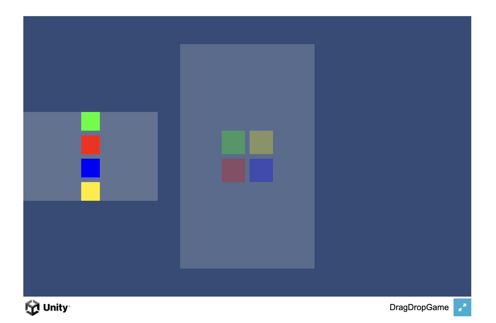

# DragDropGame

A Unity drag and drop game project with color matching mechanics.

## Creator
**Kiran Shrestha**

## About
This project serves as a base implementation for drag and drop mechanics in Unity mini-games. The game demonstrates fundamental concepts of:

- Interactive UI elements with drag and drop functionality
- Color-based matching mechanics
- Dynamic UI generation and layout management
- Event system integration for user interactions

This foundation can be extended to create more complex mini-games with similar interaction patterns.

## Features
- Drag and drop colored items
- Color matching drop zones
- Responsive UI layout
- Unity Input System integration
- Dynamic UI generation at runtime

## Setup
1. Open project in Unity 2023.3 or newer
2. Ensure Universal Render Pipeline is configured
3. Play the scene to test the drag and drop functionality

